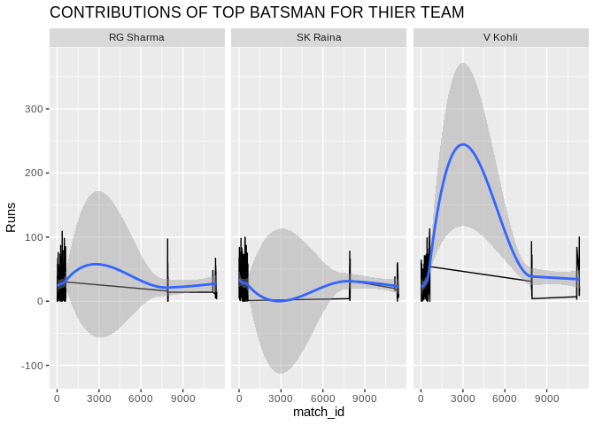

EDA On IPL
================

``` r
knitr::opts_chunk$set(fig.path='Figs/')
```

SIVAPRASAD PR

AIM

``` 
  Perform 'Exploratory Data Analysis' on dataset 'Indian Premier League'
  
```

OBJECTIVE

``` 
  1.Find out the most successful teams,players
  2.Suggest a team/player a company should endorse
```

PROCEDURE AND CODE

First we need to read the data sets. we have two separate data sets for
analysis.Let’s read it using the below commands

``` r
 matches <- read.csv("/home/siva/Downloads/matches.csv")
 del <- read.csv("/home/siva/Downloads/deliveries.csv")
```

now we have the data sets.let’s perform some basic analysis to check the
dimensions like number of rows,columns and to know how much space the
data is occupying.

``` r
dim(matches)
```

    ## [1] 756  18

``` r
dim(del)
```

    ## [1] 179078     21

``` r
object.size(matches)
```

    ## 130968 bytes

``` r
object.size(del)
```

    ## 15203664 bytes

next we are going to analyze the names,look into some entries and the
summary to get more info about the data.

``` r
names(matches)
```

    ##  [1] "id"              "season"          "city"            "date"           
    ##  [5] "team1"           "team2"           "toss_winner"     "toss_decision"  
    ##  [9] "result"          "dl_applied"      "winner"          "win_by_runs"    
    ## [13] "win_by_wickets"  "player_of_match" "venue"           "umpire1"        
    ## [17] "umpire2"         "umpire3"

``` r
names(del)
```

    ##  [1] "match_id"         "inning"           "batting_team"     "bowling_team"    
    ##  [5] "over"             "ball"             "batsman"          "non_striker"     
    ##  [9] "bowler"           "is_super_over"    "wide_runs"        "bye_runs"        
    ## [13] "legbye_runs"      "noball_runs"      "penalty_runs"     "batsman_runs"    
    ## [17] "extra_runs"       "total_runs"       "player_dismissed" "dismissal_kind"  
    ## [21] "fielder"

``` r
head(matches)
```

    ##   id season      city       date                       team1
    ## 1  1   2017 Hyderabad 2017-04-05         Sunrisers Hyderabad
    ## 2  2   2017      Pune 2017-04-06              Mumbai Indians
    ## 3  3   2017    Rajkot 2017-04-07               Gujarat Lions
    ## 4  4   2017    Indore 2017-04-08      Rising Pune Supergiant
    ## 5  5   2017 Bangalore 2017-04-08 Royal Challengers Bangalore
    ## 6  6   2017 Hyderabad 2017-04-09               Gujarat Lions
    ##                         team2                 toss_winner toss_decision result
    ## 1 Royal Challengers Bangalore Royal Challengers Bangalore         field normal
    ## 2      Rising Pune Supergiant      Rising Pune Supergiant         field normal
    ## 3       Kolkata Knight Riders       Kolkata Knight Riders         field normal
    ## 4             Kings XI Punjab             Kings XI Punjab         field normal
    ## 5            Delhi Daredevils Royal Challengers Bangalore           bat normal
    ## 6         Sunrisers Hyderabad         Sunrisers Hyderabad         field normal
    ##   dl_applied                      winner win_by_runs win_by_wickets
    ## 1          0         Sunrisers Hyderabad          35              0
    ## 2          0      Rising Pune Supergiant           0              7
    ## 3          0       Kolkata Knight Riders           0             10
    ## 4          0             Kings XI Punjab           0              6
    ## 5          0 Royal Challengers Bangalore          15              0
    ## 6          0         Sunrisers Hyderabad           0              9
    ##   player_of_match                                     venue        umpire1
    ## 1    Yuvraj Singh Rajiv Gandhi International Stadium, Uppal    AY Dandekar
    ## 2       SPD Smith   Maharashtra Cricket Association Stadium A Nand Kishore
    ## 3         CA Lynn    Saurashtra Cricket Association Stadium    Nitin Menon
    ## 4      GJ Maxwell                    Holkar Cricket Stadium   AK Chaudhary
    ## 5       KM Jadhav                     M Chinnaswamy Stadium               
    ## 6     Rashid Khan Rajiv Gandhi International Stadium, Uppal     A Deshmukh
    ##         umpire2 umpire3
    ## 1      NJ Llong        
    ## 2        S Ravi        
    ## 3     CK Nandan        
    ## 4 C Shamshuddin        
    ## 5                      
    ## 6      NJ Llong

``` r
head(del)
```

    ##   match_id inning        batting_team                bowling_team over ball
    ## 1        1      1 Sunrisers Hyderabad Royal Challengers Bangalore    1    1
    ## 2        1      1 Sunrisers Hyderabad Royal Challengers Bangalore    1    2
    ## 3        1      1 Sunrisers Hyderabad Royal Challengers Bangalore    1    3
    ## 4        1      1 Sunrisers Hyderabad Royal Challengers Bangalore    1    4
    ## 5        1      1 Sunrisers Hyderabad Royal Challengers Bangalore    1    5
    ## 6        1      1 Sunrisers Hyderabad Royal Challengers Bangalore    1    6
    ##     batsman non_striker   bowler is_super_over wide_runs bye_runs legbye_runs
    ## 1 DA Warner    S Dhawan TS Mills             0         0        0           0
    ## 2 DA Warner    S Dhawan TS Mills             0         0        0           0
    ## 3 DA Warner    S Dhawan TS Mills             0         0        0           0
    ## 4 DA Warner    S Dhawan TS Mills             0         0        0           0
    ## 5 DA Warner    S Dhawan TS Mills             0         2        0           0
    ## 6  S Dhawan   DA Warner TS Mills             0         0        0           0
    ##   noball_runs penalty_runs batsman_runs extra_runs total_runs player_dismissed
    ## 1           0            0            0          0          0                 
    ## 2           0            0            0          0          0                 
    ## 3           0            0            4          0          4                 
    ## 4           0            0            0          0          0                 
    ## 5           0            0            0          2          2                 
    ## 6           0            0            0          0          0                 
    ##   dismissal_kind fielder
    ## 1                       
    ## 2                       
    ## 3                       
    ## 4                       
    ## 5                       
    ## 6

``` r
summary(matches)
```

    ##        id              season            city           date    
    ##  Min.   :    1.0   Min.   :2008   Mumbai   :101   04/05/19:  2  
    ##  1st Qu.:  189.8   1st Qu.:2011   Kolkata  : 77   05/05/18:  2  
    ##  Median :  378.5   Median :2013   Delhi    : 74   05/05/19:  2  
    ##  Mean   : 1792.2   Mean   :2013   Bangalore: 66   06/04/19:  2  
    ##  3rd Qu.:  567.2   3rd Qu.:2016   Hyderabad: 64   06/05/18:  2  
    ##  Max.   :11415.0   Max.   :2019   Chennai  : 57   07/04/19:  2  
    ##                                   (Other)  :317   (Other) :744  
    ##                          team1                             team2    
    ##  Mumbai Indians             :101   Kolkata Knight Riders      : 95  
    ##  Kings XI Punjab            : 91   Royal Challengers Bangalore: 95  
    ##  Chennai Super Kings        : 89   Delhi Daredevils           : 89  
    ##  Royal Challengers Bangalore: 85   Mumbai Indians             : 86  
    ##  Kolkata Knight Riders      : 83   Kings XI Punjab            : 85  
    ##  Delhi Daredevils           : 72   Rajasthan Royals           : 80  
    ##  (Other)                    :235   (Other)                    :226  
    ##                       toss_winner  toss_decision       result   
    ##  Mumbai Indians             : 98   bat  :293     no result:  4  
    ##  Kolkata Knight Riders      : 92   field:463     normal   :743  
    ##  Chennai Super Kings        : 89                 tie      :  9  
    ##  Kings XI Punjab            : 81                                
    ##  Royal Challengers Bangalore: 81                                
    ##  Delhi Daredevils           : 80                                
    ##  (Other)                    :235                                
    ##    dl_applied                              winner     win_by_runs    
    ##  Min.   :0.00000   Mumbai Indians             :109   Min.   :  0.00  
    ##  1st Qu.:0.00000   Chennai Super Kings        :100   1st Qu.:  0.00  
    ##  Median :0.00000   Kolkata Knight Riders      : 92   Median :  0.00  
    ##  Mean   :0.02513   Royal Challengers Bangalore: 84   Mean   : 13.28  
    ##  3rd Qu.:0.00000   Kings XI Punjab            : 82   3rd Qu.: 19.00  
    ##  Max.   :1.00000   Rajasthan Royals           : 75   Max.   :146.00  
    ##                    (Other)                    :214                   
    ##  win_by_wickets         player_of_match
    ##  Min.   : 0.000   CH Gayle      : 21   
    ##  1st Qu.: 0.000   AB de Villiers: 20   
    ##  Median : 4.000   DA Warner     : 17   
    ##  Mean   : 3.351   MS Dhoni      : 17   
    ##  3rd Qu.: 6.000   RG Sharma     : 17   
    ##  Max.   :10.000   YK Pathan     : 16   
    ##                   (Other)       :648   
    ##                                        venue                umpire1   
    ##  Eden Gardens                             : 77   HDPK Dharmasena: 73  
    ##  M Chinnaswamy Stadium                    : 73   Asad Rauf      : 51  
    ##  Wankhede Stadium                         : 73   S Ravi         : 49  
    ##  Feroz Shah Kotla                         : 67   AK Chaudhary   : 43  
    ##  Rajiv Gandhi International Stadium, Uppal: 56   Aleem Dar      : 38  
    ##  MA Chidambaram Stadium, Chepauk          : 49   BF Bowden      : 37  
    ##  (Other)                                  :361   (Other)        :465  
    ##           umpire2              umpire3   
    ##  C Shamshuddin: 57                 :637  
    ##  S Ravi       : 57   C Shamshuddin : 10  
    ##  SJA Taufel   : 54   Nitin Menon   : 10  
    ##  RJ Tucker    : 38   O Nandan      : 10  
    ##  CK Nandan    : 36   Anil Chaudhary:  9  
    ##  RB Tiffin    : 30   S Ravi        :  8  
    ##  (Other)      :484   (Other)       : 72

``` r
summary(del)
```

    ##     match_id         inning                           batting_team  
    ##  Min.   :    1   Min.   :1.000   Mumbai Indians             :22619  
    ##  1st Qu.:  190   1st Qu.:1.000   Kings XI Punjab            :20931  
    ##  Median :  379   Median :1.000   Royal Challengers Bangalore:20908  
    ##  Mean   : 1802   Mean   :1.483   Kolkata Knight Riders      :20858  
    ##  3rd Qu.:  567   3rd Qu.:2.000   Chennai Super Kings        :19762  
    ##  Max.   :11415   Max.   :5.000   Delhi Daredevils           :18786  
    ##                                  (Other)                    :55214  
    ##                       bowling_team        over            ball      
    ##  Mumbai Indians             :22517   Min.   : 1.00   Min.   :1.000  
    ##  Royal Challengers Bangalore:21236   1st Qu.: 5.00   1st Qu.:2.000  
    ##  Kolkata Knight Riders      :20940   Median :10.00   Median :4.000  
    ##  Kings XI Punjab            :20782   Mean   :10.16   Mean   :3.616  
    ##  Chennai Super Kings        :19556   3rd Qu.:15.00   3rd Qu.:5.000  
    ##  Delhi Daredevils           :18725   Max.   :20.00   Max.   :9.000  
    ##  (Other)                    :55322                                  
    ##        batsman          non_striker                 bowler      
    ##  V Kohli   :  4211   SK Raina :  4173   Harbhajan Singh:  3451  
    ##  SK Raina  :  4044   S Dhawan :  4090   A Mishra       :  3172  
    ##  RG Sharma :  3816   V Kohli  :  4071   PP Chawla      :  3157  
    ##  S Dhawan  :  3776   RG Sharma:  3858   R Ashwin       :  3016  
    ##  G Gambhir :  3524   G Gambhir:  3740   SL Malinga     :  2974  
    ##  RV Uthappa:  3492   AM Rahane:  3467   DJ Bravo       :  2711  
    ##  (Other)   :156215   (Other)  :155679   (Other)        :160597  
    ##  is_super_over         wide_runs          bye_runs         legbye_runs     
    ##  Min.   :0.0000000   Min.   :0.00000   Min.   :0.000000   Min.   :0.00000  
    ##  1st Qu.:0.0000000   1st Qu.:0.00000   1st Qu.:0.000000   1st Qu.:0.00000  
    ##  Median :0.0000000   Median :0.00000   Median :0.000000   Median :0.00000  
    ##  Mean   :0.0004523   Mean   :0.03672   Mean   :0.004936   Mean   :0.02114  
    ##  3rd Qu.:0.0000000   3rd Qu.:0.00000   3rd Qu.:0.000000   3rd Qu.:0.00000  
    ##  Max.   :1.0000000   Max.   :5.00000   Max.   :4.000000   Max.   :5.00000  
    ##                                                                            
    ##   noball_runs        penalty_runs      batsman_runs     extra_runs     
    ##  Min.   :0.000000   Min.   :0.0e+00   Min.   :0.000   Min.   :0.00000  
    ##  1st Qu.:0.000000   1st Qu.:0.0e+00   1st Qu.:0.000   1st Qu.:0.00000  
    ##  Median :0.000000   Median :0.0e+00   Median :1.000   Median :0.00000  
    ##  Mean   :0.004183   Mean   :5.6e-05   Mean   :1.247   Mean   :0.06703  
    ##  3rd Qu.:0.000000   3rd Qu.:0.0e+00   3rd Qu.:1.000   3rd Qu.:0.00000  
    ##  Max.   :5.000000   Max.   :5.0e+00   Max.   :7.000   Max.   :7.00000  
    ##                                                                        
    ##    total_runs       player_dismissed  dismissal_kind             fielder      
    ##  Min.   : 0.000             :170244          :170244                 :172630  
    ##  1st Qu.: 0.000   SK Raina  :   162   caught :  5348   MS Dhoni      :   159  
    ##  Median : 1.000   RG Sharma :   155   bowled :  1581   KD Karthik    :   152  
    ##  Mean   : 1.314   RV Uthappa:   153   run out:   852   RV Uthappa    :   125  
    ##  3rd Qu.: 1.000   V Kohli   :   143   lbw    :   540   SK Raina      :   115  
    ##  Max.   :10.000   S Dhawan  :   137   stumped:   278   AB de Villiers:   114  
    ##                   (Other)   :  8084   (Other):   235   (Other)       :  5783

now we have completed the basic steps of data analysis. since we have
two data sets we can perform EXPLORATORY DATA ANALYSIS(EDA) on two sets
separately and later on we can combine them for more. in order to
perform EDA we need to add some libraries

``` r
library(ggplot2)
library(magrittr)#for using group by
library(dplyr)
```

    ## 
    ## Attaching package: 'dplyr'

    ## The following objects are masked from 'package:stats':
    ## 
    ##     filter, lag

    ## The following objects are masked from 'package:base':
    ## 
    ##     intersect, setdiff, setequal, union

EDA ON DATA SET - MATCHES

let’s analyze this on various aspects.

1)  Does Toss winner have any advantage over winning a match

<!-- end list -->

``` r
toss<-data.frame(matches$team1,matches$team2,matches$toss_winner,matches$winner)
tossdesc<-ifelse(as.character((matches$toss_winner))==as.character((matches$winner)),"won","lose")
toss<-data.frame(toss,tossdesc)
ggplot(toss[which(!is.na(toss$tossdesc)),],aes(tossdesc,fill=tossdesc))+geom_bar()+xlab("TOSS")+ylab("Matches Won")+ggtitle("DOES TOSS WINNING HAVE ANY ADVANTAGE")
```

<!-- -->

from the analysis we can conclude that Toss winning gives some advantage
to a Team.

2)Does Home play give any advantage for winning a match

``` r
teamcity<-matches[matches$season!="2009",]
teamcity$date<- as.Date(teamcity$date)
teamcity2<-teamcity[teamcity$date < as.Date("2014-04-16") | teamcity$date > as.Date("2014-04-30"),]
teamcity2$hometeam[teamcity2$city=="Bangalore"]<- "Royal Challengers Bangalore"
teamcity2$hometeam[teamcity2$city=="Chennai"]<- "Chennai Super Kings"
teamcity2$hometeam[teamcity2$city=="Delhi"]<- "Delhi Daredevils"
teamcity2$hometeam[teamcity2$city=="Chandigarh"]<- "Kings XI Punjab"
teamcity2$hometeam[teamcity2$city=="Jaipur"]<- "Rajasthan Royals"
teamcity2$hometeam[teamcity2$city=="Mumbai"]<- "Mumbai Indians"
teamcity2$hometeam[teamcity2$city=="Kolkata"]<- "Kolkata Knight Riders"
teamcity2$hometeam[teamcity2$city=="Kochi"]<- "Kochi Tuskers Kerala"
teamcity2$hometeam[teamcity2$city=="Hyderabad" & teamcity2$season <=2012]<- "Deccan Chargers"
teamcity2$hometeam[teamcity2$city=="Hyderabad" & teamcity2$season >2012]<- "Sunrisers Hyderabad"
teamcity2$hometeam[teamcity2$city=="Ahmedabad"]<- "Rajasthan Royals"
teamcity2$hometeam[teamcity2$city=="Dharamsala"]<- "Kings XI Punjab"
teamcity2$hometeam[teamcity2$city=="Visakhapatnam" & teamcity2$season== 2015]<- "Sunrisers Hyderabad"
teamcity2$hometeam[teamcity2$city=="Ranchi" & teamcity2$season== 2013]<- "Kolkata Knight Riders"
teamcity2$hometeam[teamcity2$city=="Ranchi" & teamcity2$season > 2013]<- "Chennai Super Kings"
teamcity2$hometeam[teamcity2$city=="Rajkot" ]<- "Gujarat Lions"
teamcity2$hometeam[teamcity2$city=="Kanpur" ]<- "Gujarat Lions"
teamcity2$hometeam[teamcity2$city=="Raipur" ]<- "Delhi Daredevils"
teamcity2$hometeam[teamcity2$city=="Nagpur" ]<- "Deccan Chargers"
teamcity2$hometeam[teamcity2$city=="Indore" ]<- "Kochi Tuskers Kerala"
teamcity2$hometeam[teamcity2$city=="Pune" & teamcity2$season!= 2016]<- "Pune Warriors"
teamcity2$hometeam[teamcity2$city=="Pune" & teamcity2$season== 2016]<- "Rising Pune Supergiants"
teamcity2<-teamcity2[ which(!is.na(teamcity2$hometeam)),]
teamcity2$result<-ifelse(as.character((teamcity2$winner))==as.character((teamcity2$hometeam)),"home","away")
ggplot(teamcity2[which(!is.na(teamcity2$result)),],aes(result,fill=result))+geom_bar()+xlab("Ground")+ylab("Matches Won")+ggtitle("DOES HOME GROUND GIVE ANY ADVANTAGE")
```

<!-- -->

from the analysis the probability of match played in home and away
grounds are almost same.so home play cannot be consider as an advantage

3)Total Number of matches won by each team in IPL

``` r
ggplot(matches,aes(winner))+geom_bar(fill="brown")+theme(axis.text.x = element_text(angle = 90,))+xlab("Teams")+ylab("Number of matches won")+ggtitle("Total No of matches won by each team")
```

<!-- --> from the bar plot we can analyze
that team MI,CSK and KKR are among the top three teams.

4)Number of matches lost by each team in IPL

``` r
losers<-table(matches$team1)+table(matches$team2)
b<-table(matches$winner)
losers<-c(4,losers)
losec<-losers-b
losec<-data.frame(losec)
names(losec)<-c("team","count")
ggplot(losec,aes(x=team,y=count))+geom_bar(stat="identity")+theme(axis.text.x = element_text(angle=90))+ylab("No of matches Lost")+ggtitle("NO OF MATCHES LOST BY EACH TEAM")
```

<!-- --> 5) Win By Runs

``` r
f<-data.frame(winner=matches$winner,runs=matches$win_by_runs)
f[f=='0']<-NA
f<-na.omit(f)
ggplot(f, aes(x=1,y=runs)) +
  geom_point(col="red") +
  facet_wrap(~winner)+
  scale_color_viridis_d()+geom_hline(yintercept = 75)+ggtitle("WIN BY RUNS")
```

<!-- -->

6)  Win By Wickets

<!-- end list -->

``` r
fw<-data.frame(winner=matches$winner,wicket=matches$win_by_wickets)
fw[fw=='0']<-NA
fw<-na.omit(fw)
ggplot(fw, aes(x=1,y=wicket)) +
  geom_point(col="green") +
  facet_wrap(~winner)+
  scale_color_viridis_d()+ggtitle("WIN BY WICKETS")
```

<!-- -->

from these analysis we can conclude that the most successful teams in
IPL are :

``` 
      1. Mumbai Indians
      2. Chennai Super Kings
      3. Kolkata Knight Riders
```

Now let’s analyze the data set del.

8)  TOP BATSMAN

<!-- end list -->

``` r
del %>% group_by(batsman)%>% summarise(runs=sum(batsman_runs))%>% arrange(desc(runs))%>% filter(runs > 3000)%>%ggplot(aes(reorder(batsman,+runs),y=runs,fill=batsman))+geom_bar(stat="identity")+theme(axis.text.x = element_text(angle=90))+xlab("Batsman")+ylab("runs scored")+ggtitle("Top batsman with score > 3000")+guides(fill=F)
```

    ## `summarise()` ungrouping output (override with `.groups` argument)

<!-- --> 9) TOP BOWLERS

``` r
del %>% group_by(bowler) %>% filter(player_dismissed!="") %>% summarise(wickets= length(player_dismissed))%>%filter(wickets>150)%>%ggplot(aes(reorder(bowler,+wickets),y=wickets,fill=bowler))+geom_bar(stat="identity")+theme(axis.text.x = element_text(angle=90))+xlab("Bowler")+ylab("wickets")+ggtitle("Top bowlers with wickets > 100")+guides(fill=F)
```

    ## `summarise()` ungrouping output (override with `.groups` argument)

<!-- -->

10) Contributions given by top batsman

<!-- end list -->

``` r
colnames(matches)[1]<- "match_id"
del %>% left_join(matches) %>% filter(batsman=="V Kohli"| batsman=="SK Raina" |batsman=="RG Sharma") %>% filter(result == "normal") %>%
  group_by(batsman,match_id,batting_team,winner) %>%  summarise(Runs=sum(batsman_runs)) %>% ggplot(aes(match_id,Runs))+geom_line()+geom_smooth()+facet_wrap(~batsman)+ggtitle("CONTRIBUTIONS OF TOP BATSMAN FOR THIER TEAM ")
```

    ## Joining, by = "match_id"

    ## `summarise()` regrouping output by 'batsman', 'match_id', 'batting_team' (override with `.groups` argument)

    ## `geom_smooth()` using method = 'loess' and formula 'y ~ x'

<!-- --> 11) Contributions of top
batsman for winning and losing

``` r
del %>% left_join(matches) %>% filter(batsman=="V Kohli"| batsman=="SK Raina" |batsman=="RG Sharma") %>% filter(result == "normal") %>%
  group_by(batsman,match_id,batting_team,winner) %>%  summarise(Runs=sum(batsman_runs)) %>% ggplot(aes(match_id,Runs))+geom_line()+geom_smooth()+facet_grid(batsman ~ifelse(as.character(batting_team)== as.character(winner),"CONTRIBUTION FOR WIN","CONTRIBUTION FOR LOSE"))+ggtitle("CONTRIBUTIONS OF TOP BATSMAN FOR THIER TEAM ")
```

    ## Joining, by = "match_id"

    ## `summarise()` regrouping output by 'batsman', 'match_id', 'batting_team' (override with `.groups` argument)

    ## `geom_smooth()` using method = 'loess' and formula 'y ~ x'

<!-- -->

12)Seasonal Runs

``` r
del %>% left_join(matches)%>% group_by(batsman,season) %>% filter(batsman == "V Kohli"| batsman == "SK Raina" | batsman == "RG Sharma") %>% summarise(match_id,batsman,season,batsman_runs,seasonal_runs = sum(batsman_runs))%>%ggplot(aes(season,seasonal_runs,col=batsman))+geom_line()+ scale_x_continuous(breaks = 2008:2019)+ggtitle("SEASONAL RUNS ANALYSIS")
```

    ## Joining, by = "match_id"

    ## `summarise()` regrouping output by 'batsman', 'season' (override with `.groups` argument)

<!-- -->

13)Seasonal Boundaries

``` r
del %>% left_join(matches)%>% filter(batsman == "V Kohli"| batsman == "SK Raina" | batsman == "RG Sharma") %>% filter(batsman_runs == 4| batsman_runs == 6) %>%  group_by(batsman,season) %>% summarise(match_id,batsman,season,batsman_runs,boundary = length(batsman_runs))%>%ggplot(aes(season,boundary,col=batsman))+geom_line()+ scale_x_continuous(breaks = 2008:2019)+ggtitle("SEASONAL BOUNDARY ANALYSIS")
```

    ## Joining, by = "match_id"

    ## `summarise()` regrouping output by 'batsman', 'season' (override with `.groups` argument)

<!-- -->

RESULT

from the analysis we can conclude that

Top Batsman

``` 
  1.V Kohli
  2.SK Raina
  3.RG Sharma
```

Top Bowlers

``` 
  1.SL Malinga
  2.DJ Bravo
  3.A Mishra
```

Team a company should endorse

``` 
  Mumbai Indians
  
```

Player a company should endorse

``` 
  V Kohli
  
  
```
